

# Qwicker

Qwicker is a mobile application built with React Native dedicated to facilitating efficient item delivery services, akin
to popular platforms like Lalamove. This project hosts a comprehensive suite of features, including authentication,
role-based access control, user and shipper registration, an admin dashboard, shipper profile viewing, item posting,
auction and shipper selection, rating and feedback systems, order management and notification, online payment
integration with VNPay, and system administration functionalities. With a focus on user convenience and effective
management, Qwicker serves as a valuable resource for developers looking to explore and contribute to the advancement of
delivery service applications.

For a comprehensive demo, you can watch the full video on YouTube by clicking on the link
provided [here](https://www.youtube.com/watch?v=GISC5GFzDdM).

## Table of contents

* 🎥[Overview](#overview)
* ✨[Features](#features)
* 🛠️[Architecture](#architecture)
* 🏗️[Diagram](#diagram)
* ⛳️[Locating Shippers Using Geohashing](#locating-shippers-using-geohashing)
* 📍[Caching Shippers Locations](#caching-shippers-locations)

## 🎥Overview

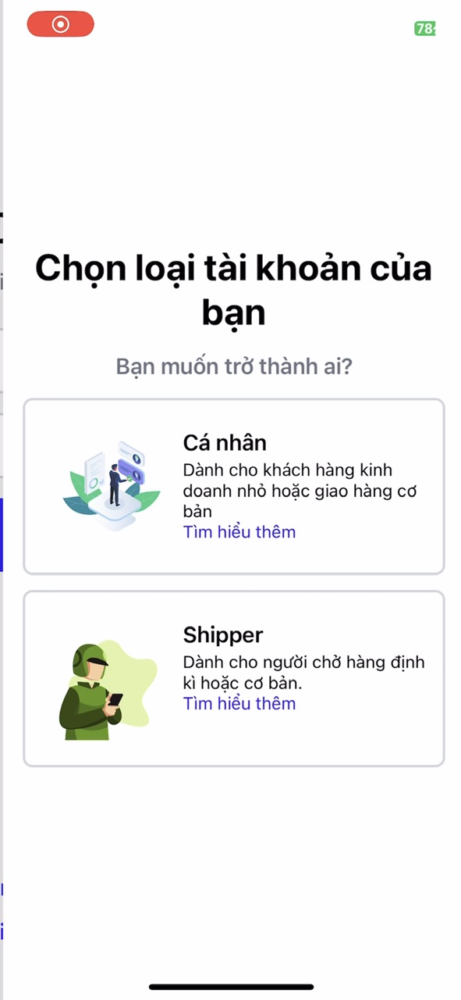</img>
</img>
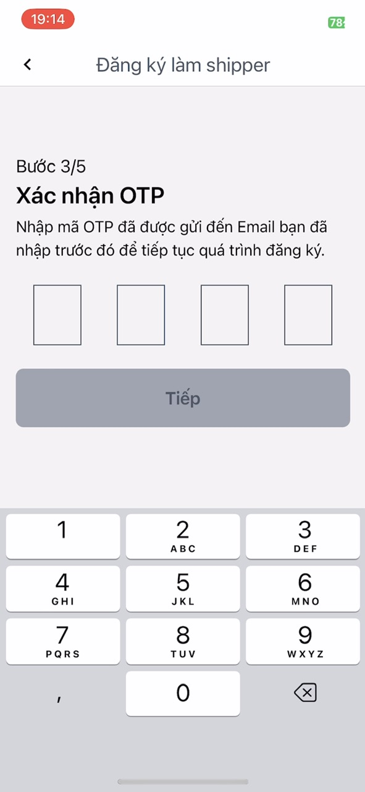</img>
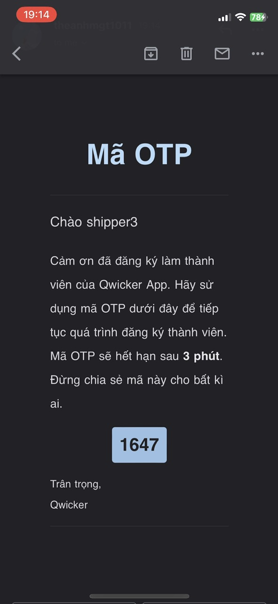</img>
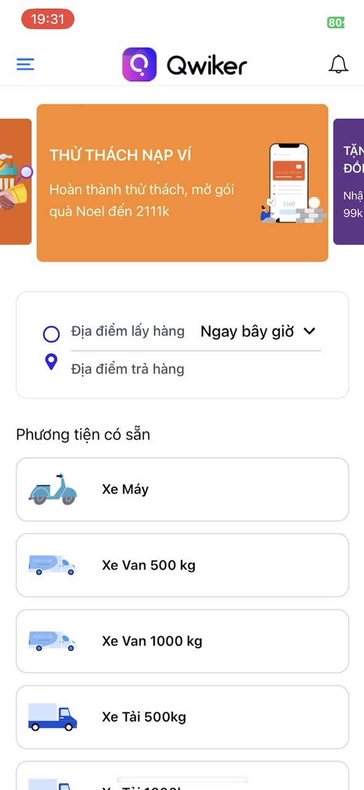</img>
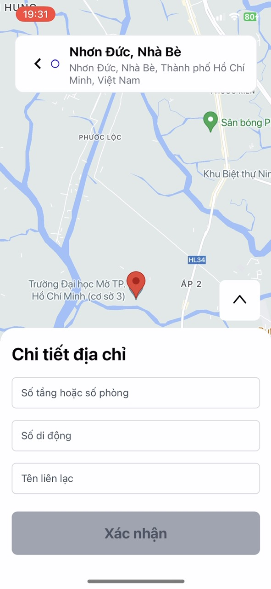</img>
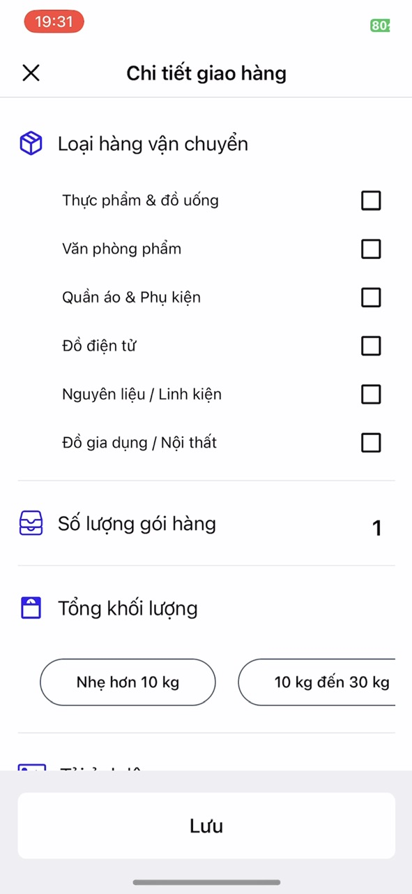</img>
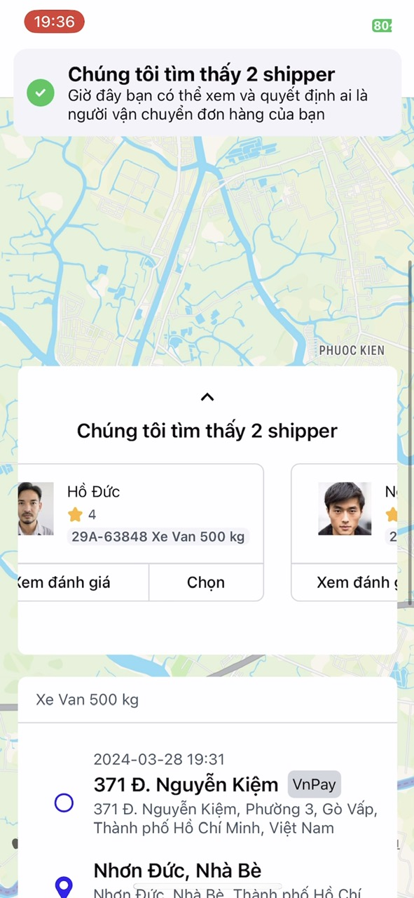</img>
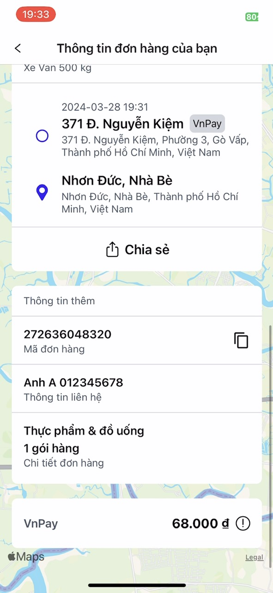</img>
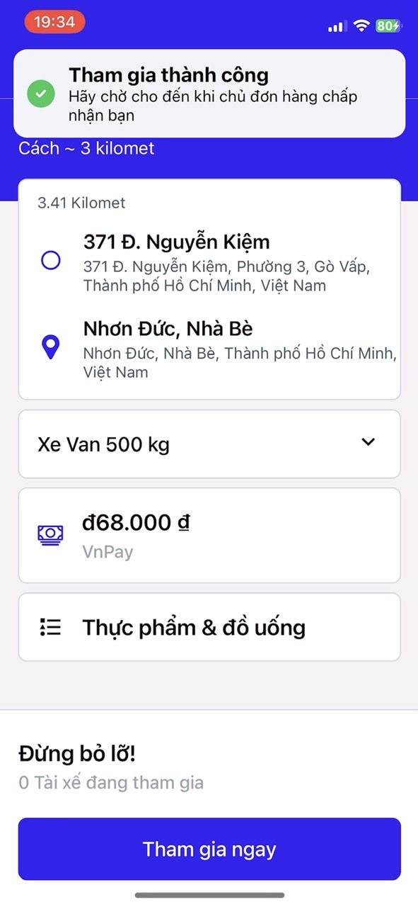</img>
</img>
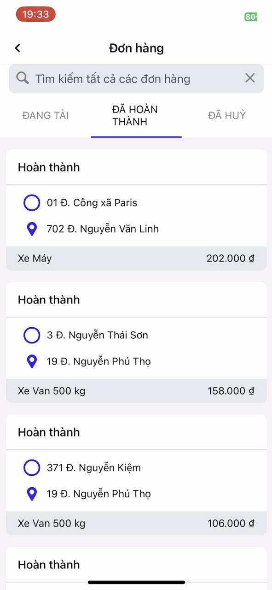</img>

## ✨Features

User Management:

- Feature: Authentication and Role-based Access Control
- Description: Users can register and log in with roles such as admin, shipper, and regular user. Each role has specific
  permissions within the app.

User and Shipper Registration:

- Feature: Account Registration
- Description: Users and shippers can register accounts. Shippers are required to provide additional information such as
  avatar and identification details. Shipper accounts need approval from the admin.

Shipper Information Viewing:

- Feature: Shipper Profile
- Description: Users can view shipper profiles and details, including community ratings and feedback from previous
  deliveries.

Item Posting:

- Feature: Posting Delivery Requests
- Description: Users can post items they want to ship, providing details such as pickup and delivery locations, package
  dimensions, and any special requirements.

Auction and Shipper Selection:

- Feature: Bidding System
- Description: Shippers bid on posted delivery requests. The owner of the post chooses a shipper through an auction
  process. Only the post owner sees the auction details. The system automatically notifies the chosen shipper and
  notifies other bidders of rejection.

Rating and Commenting:

- Feature: Rating and Feedback System
- Description: Users can rate and leave feedback on shippers based on their delivery experiences.

Order Recording and Notification:

- Feature: Order Management and Notification
- Description: Shippers can record completed shipping orders within the app. This action triggers email notifications to
  customers to inform them that their orders have been completed.

Online Payment with VNPay:

- Feature: Online Payment Integration
- Description: Users can make online payments for delivery services through VNPay, providing a convenient and secure
  payment method.

## 🛠Architecture

This project is built using a microservices architecture, with the following components:

- **Backend**: Developed using Spring Boot, providing RESTful APIs for the mobile application.
- **Frontend**: Built with React Native, providing a responsive and user-friendly interface for both iOS and Android
  devices.
- **Database**: MySQL and MongoDB are used for storing user data, shipper information, and delivery requests.
- **State Management**: Redux is used for managing the application state in the React Native app.
- **Styling**: Tailwind CSS is used for styling the React Native components, ensuring a consistent and modern design.
- **Authentication**: JWT (JSON Web Tokens) is used for secure authentication and authorization of users and shippers.
- **Payment Integration**: VNPay is integrated for online payment processing, allowing users to pay for delivery
  services securely.
  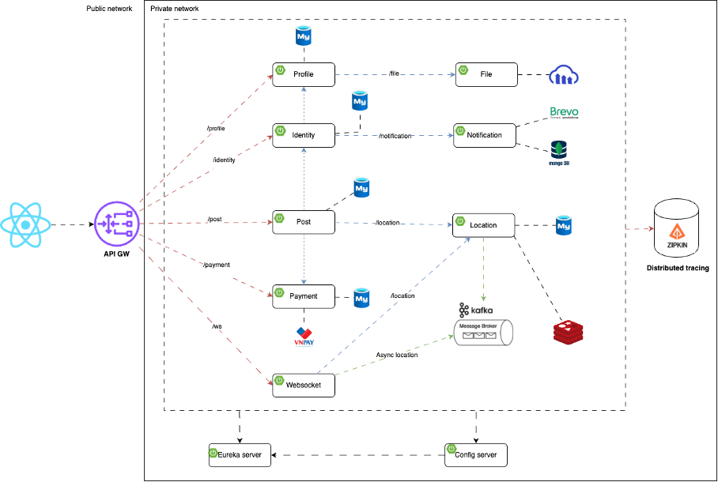</img>

## 🏗️Diagram

Use case Diagram for entire flow of the application (Vietnamese):

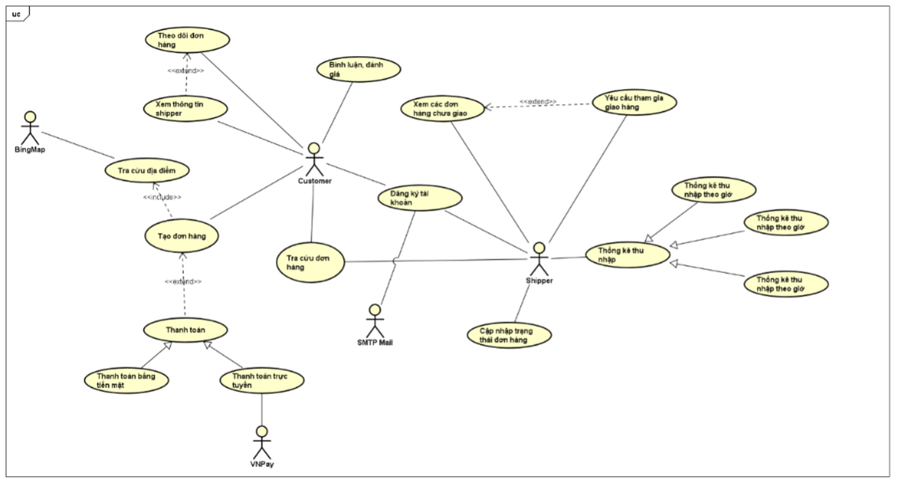</img>

Workflow Diagram for making a delivery request (Vietnamese):

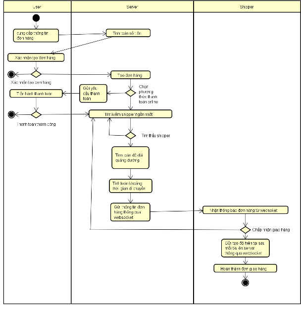</img>

## ⛳️Locating Shippers Using Geohashing

When a driver logs in and switches their status to “active,” the mobile application sends their current location (
latitude and longitude) to the backend every 5 seconds. The backend immediately converts these coordinates into a
geohash string of 4–5 characters and stores it in Redis as a key–value pair, where the key is the driver’s ID and the
value is the geohash string.

When a new order is placed, the system also converts the pickup location into a geohash of the same length and queries
Redis to find drivers located in the same geohash cell. If no drivers are found, the search area is expanded to
neighboring geohash cells by modifying the last character of the geohash string. Once a list of potential candidates is
obtained, the system calculates the actual distance from each driver to the pickup location and selects the closest one
for the delivery.

For example, suppose the user selects a pickup point in Dĩ An City with a geohash of w3gv. If no shippers are available
in this area, the system will expand the search to nearby cells such as w3gu, w3gs, w3gt, w3gw, w3gy, and so on.
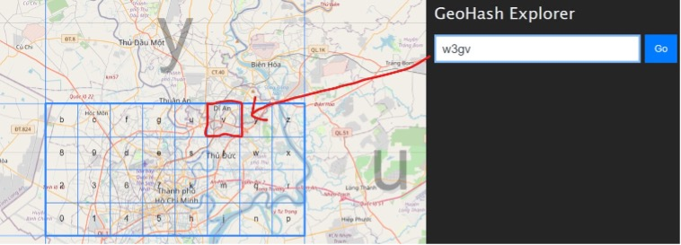</img>

*Geohash mapping for several provinces and cities in southern Vietnam.*

In addition to representing a specific area, geohash can also be used to estimate the distance between two points on
Earth, which allows for quick comparisons to identify the nearest location to a target point. However, geohash has a
limitation—it treats the Earth’s surface as flat and calculates the straight-line (great-circle) distance between two
points. This means it cannot account for obstacles or road conditions along the route, which can make the distance
comparison inaccurate.

For this reason, the system uses geohash only to identify the five closest candidates. It then calls the Google Maps
service to calculate and compare the actual travel distances and times for these candidates, ultimately selecting the
driver closest to the pickup location.

## 📍Caching Shippers Locations

To enable the system to track shipper locations, every shipper is required to send their current position via WebSocket
every 5 seconds. The data sent includes both the latitude and longitude from 5 seconds ago and the current coordinates.

Upon receiving this data, the server applies an algorithm to generate a geohash string, then compares the previous and
current geohash values to determine whether the shipper’s location in Redis needs to be updated.

The data is stored in Redis using two structures, as shown below:

**Shippers**

| Key (Geohash) | Values (Shipper Information)                                 |
|---------------|--------------------------------------------------------------|
| w3gv1         | {s1, Motorbike, ts}, {s2, Motorbike, ts}, {s3, Truck, ts}    |
| w3gv2         | {s4, Motorbike, ts}, {s5, Pickup Truck, ts}, {s6, Truck, ts} |
| w3gv3         | {s7, 500kg Truck, ts}, {s8, Pickup Truck, ts}                |

*Data structure for storing the list of shippers by Geohash region.*

---

**Location**

| Key (Shipper ID) | Value (Geohash) |
|------------------|-----------------|
| s1               | w3gv1           |
| s2               | w3gv1           |
| s3               | w3gv1           |
| …                | …               |
| s7               | w3gv3           |

*Data structure mapping shipper IDs to their current Geohash region.*

With this data structure, the system can easily retrieve all shippers within a specific geohash region based on its
geohash code. Conversely, it can also determine the region a specific shipper is in by looking up their shipper ID.
